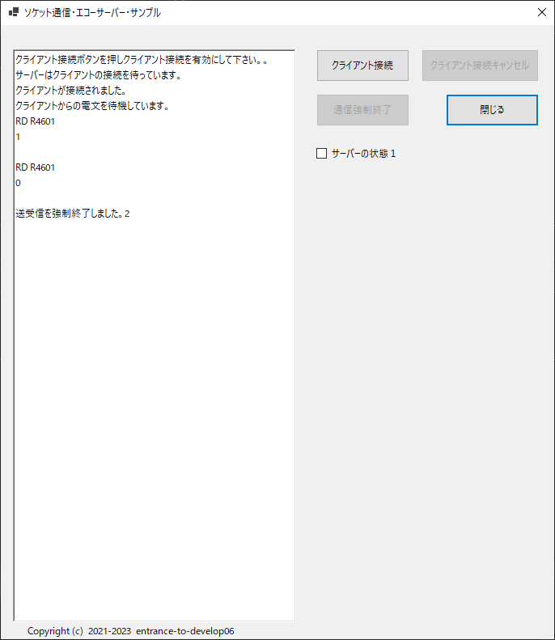

## :computer: ソケット通信(TCP)・エコーサーバーサンプル  

## 開発環境  

```
統合開発環境：Microsoft Visual Studio 2022 Community Edition 17.4.4  
プログラム言語：C# 10  
フレームワーク：.NET 6.0.13  
開発SDK：.NET SDK 6.0.405  
デスクトップ：Windows Formsアプリケーション  
```

### 画面イメージ  
  

___