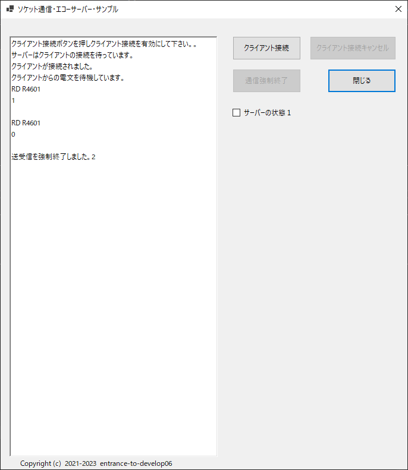

## :computer: ソケット通信(TCP)・エコーサーバーサンプル  

## 開発環境  

```
統合開発環境：Microsoft Visual Studio 2022 Community Edition 17.14.19  
プログラム言語：C# 12  
フレームワーク：.NET 8.0.21  
開発SDK：.NET SDK 8.0.415  
デスクトップ：Windows Formsアプリケーション  
```

### 画面イメージ  
  

___